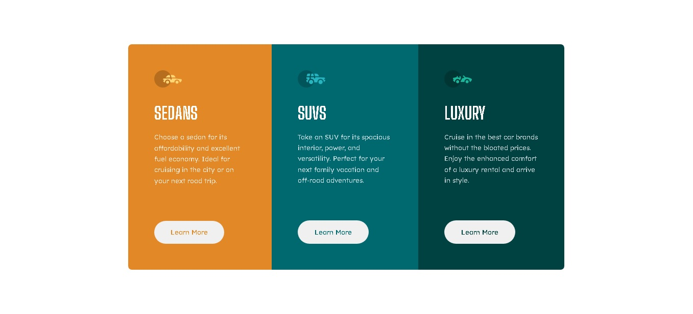

# My 3 Column Preview Card Component Solution | Frontend Mentor

This is my solution to the [3-column preview card component challenge on Frontend Mentor](https://www.frontendmentor.io/challenges/3column-preview-card-component-pH92eAR2-).

## Overview

### The challenge

Users should be able to:

- View the optimal layout depending on their device's screen size
- See hover states for interactive elements

### Screenshot

### Links

- Solution URL: [Add solution URL here](https://your-solution-url.com)
- Live Site URL: [Add live site URL here](https://your-live-site-url.com)

## My process

### Built with

- Semantic HTML5 markup
- CSS custom properties
- Flexbox

### What I learned

This is a very cool challenge. I've learned so much about flex laout.

## Author

- Website - [Bborasen.com](http://bborasen.com)
- Frontend Mentor - [@yourusername](https://www.frontendmentor.io/profile/bora-sen)
